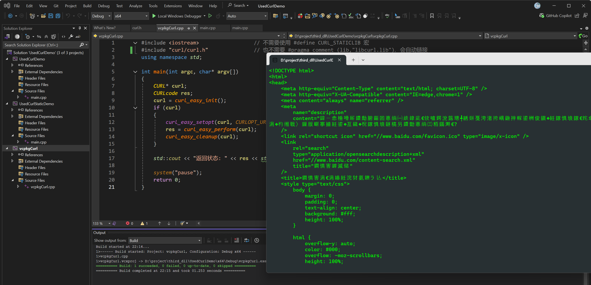

- 本机通过源码编译 libcurl 8.15.0静态库和动态库教程： [C++ 编译和运行 LibCurl 动态库和静态库](https://xmuli.blog.csdn.net/article/details/150998055)

- 编译好的静态库和动态库文件curl-8.15.0 下载 [v2025.08.29](https://github.com/XMuli/NetworkExample/releases/tag/v2025.08.29)：

  

**Project Code:**

- UsedCurlDemo: C++ 调用 libcurl （本机源码编译的）动态库示例

- UsedCurlStaticDemo：C++ 调用 libcurl （本机源码编译的）静态库示例

- vcpkgCurl：C++ 调用 libcurl （本机 vcpkg 下载和编译的）动态库示例

  

  